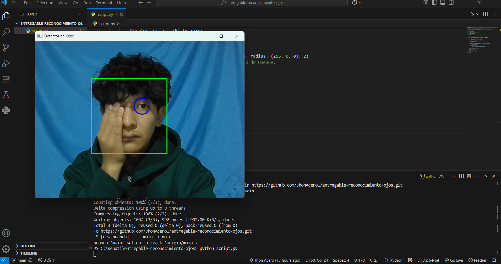
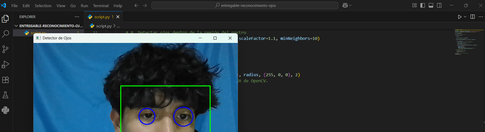

  **RESULTADO DE RECONOCIMIENTO DE OJOS**

  **Descripcion** :
  
Generar un script Python que haga el reconocimiento de ojos, los ojos deben estar enmarcados en un rectángulo o círculo azul.

Se necesitaron instalar la libreria 
Opencv con un comando de 
pip install opencv

y la expliacion de los codigos de scrip lo puse en el codigo

 **Ressultados de prueba**

**Prueba con un ojo**

**Resultado de prueba con dos ojos**

